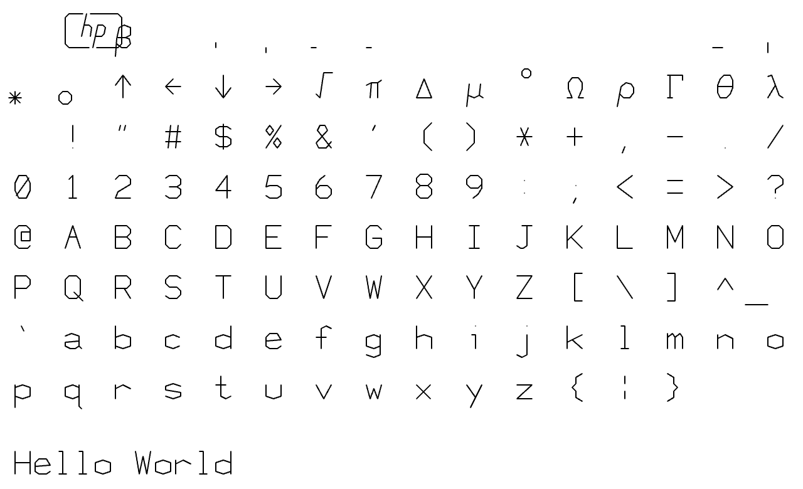

# single-line-font-resources

Repository of miscellaneous single-line fonts, for creative coding

---

### p5.js port of HP1345A vector font

Poul-Henning Kamp [reverse-engineered the character generator](https://phk.freebsd.dk/hacks/Wargames/index.html) on the HP1345A digital vector display (c.1985). This p5.js version is adapted from his work, and loads the original ROM binaries.

* In [this repository](HP1345A_single_line_font/sketch.js)
* At [editor.p5js.org](https://editor.p5js.org/golan/sketches/ir_bD05uZ)

---

