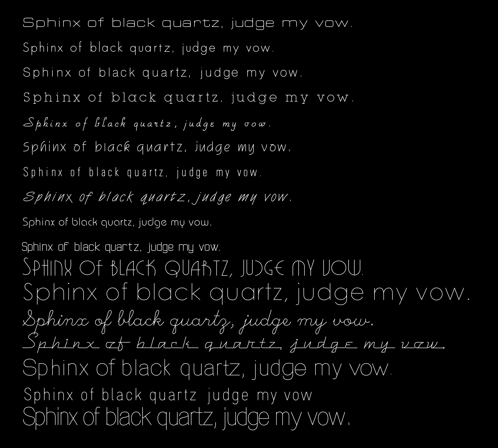
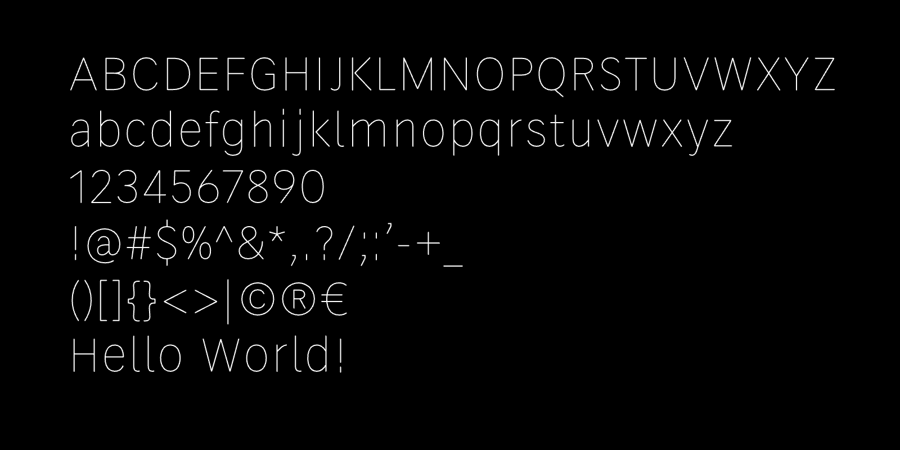
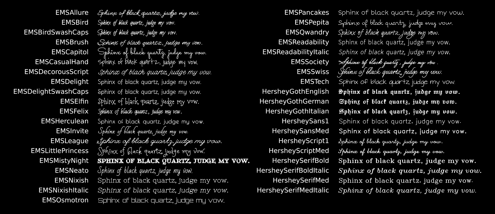
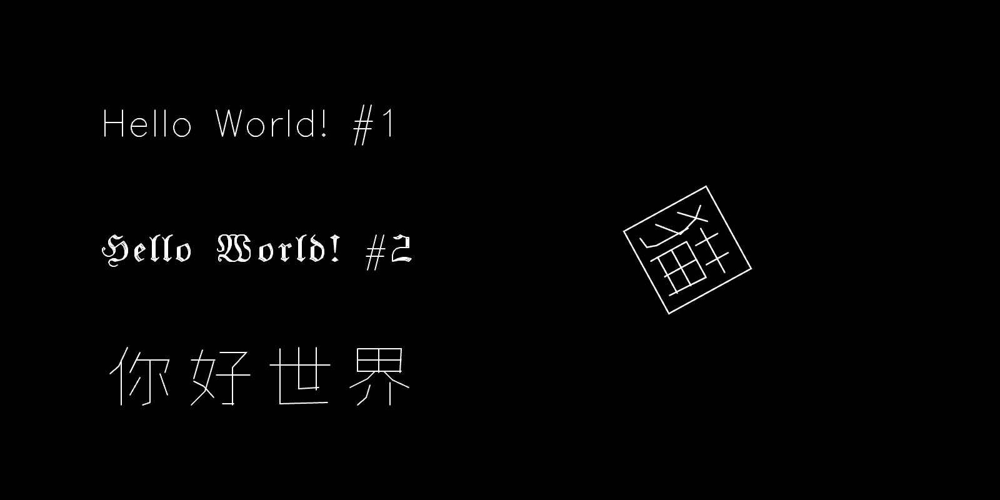
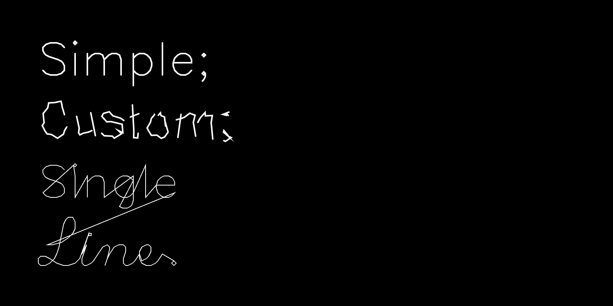
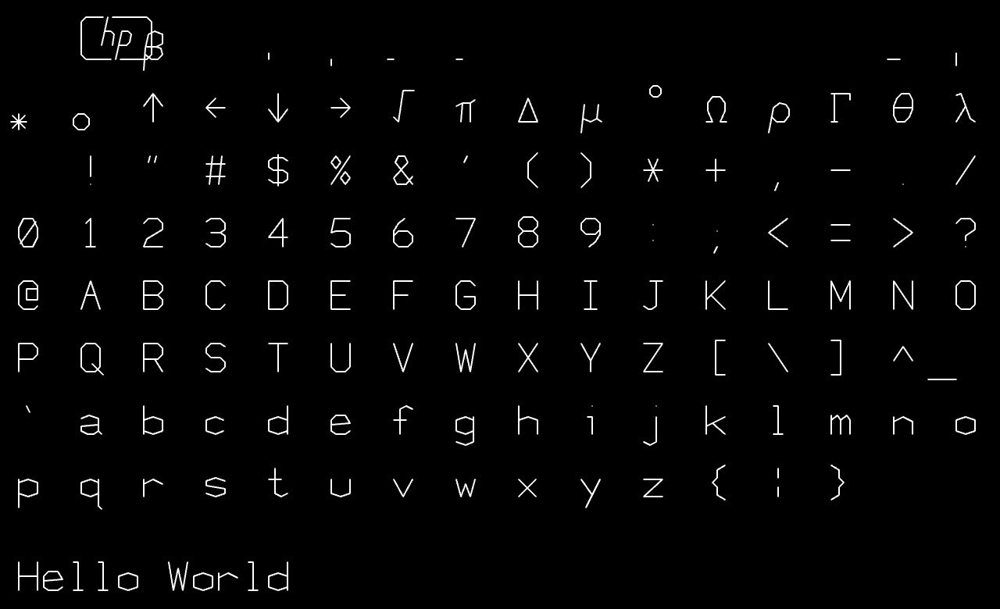
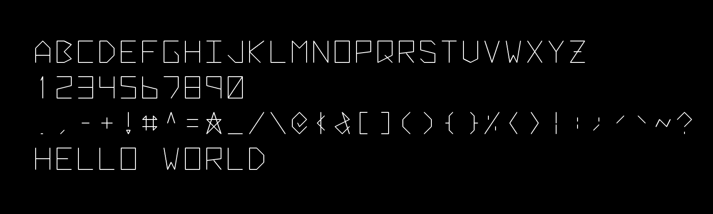
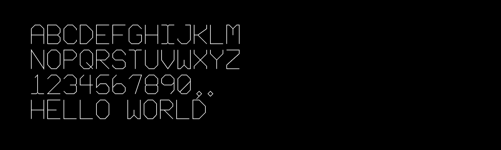

# p5-single-line-font-resources

*This is a repository of p5.js programs for loading and displaying single-line vector fonts (also called single-stroke or monoline fonts) in a variety of formats — including TTF, SVG Font, Hershey Font, and others. Such fonts are ideally suited to creative coding, pen-plotting, and CNC machining.*

#### Contents

* [p5.js Parser/Renderer for Single-Line TTF Fonts](#p5js-parserrenderer-for-single-line-ttf-fonts)
* [p5.js Parser/Renderer for Single-Line SVG Fonts](#p5js-parserrenderer-for-single-line-svg-fonts)
* [(Classic) Hershey Fonts in p5.js](#classic-hershey-fonts-in-p5js)
* [Minimal SVG Font, Inlined in p5.js](#minimal-svg-font-inlined-in-p5js)
* [p5.js port of Kamp's HP1345A vector font](#p5js-port-of-kamps-hp1345a-vector-font)
* [p5.js port of Logg/Hudson's *Asteroids* font](#p5js-port-of-logghudsons-asteroids-font)
* [p5.js port of Jared Schiffman's Font](#p5js-port-of-jared-schiffmans-font)
* [Additional Resources](#additional-resources)
* [Some Inspirational Media](#some-inspirational-media)

---

### p5.js Parser/Renderer for Single-Line TTF Fonts

Genuine *single-line* TrueType (.TTF) fonts are comparatively rare, and are not rendered properly by most graphics tools — including p5's built-in `text()` command, as well as commercial tools like Adobe Illustrator. Here, an [archive](p5_single_line_ttf_fonts/single_stroke_ttf_fonts/) of single-line TTF fonts is provided, as well as a p5.js [program](p5_single_line_ttf_fonts/) which is able to load, parse, display, and provide control points for those fonts. Unlike Hershey fonts, many of these TTFs are constructed in part from quadratic Bézier segments, and thus have real curves instead of polylines. The program makes use of [opentype.js](https://opentype.js.org/).

* An [archive](p5_single_line_ttf_fonts/single_stroke_ttf_fonts/) of single-line TTF fonts, primarily via [imajeenyus.com](http://www.imajeenyus.com/computer/20150110_single_line_fonts/index.shtml)
* A p5.js program to load single-line TTFs in p5.js: In [this repository](p5_single_line_ttf_fonts/sketch.js), & at [editor.p5js.org](https://editor.p5js.org/golan/sketches/7kMYzCpfM). By Golan Levin.
* Don't ignore these important [technical notes](p5_single_line_ttf_fonts/README.md) about the TTF fonts and p5.js code!

---

### p5.js Parser/Renderer for Single-Line SVG Fonts

SVG 1.1 Fonts are a lesser-known open standard, defined [here](https://www.w3.org/TR/SVG11/fonts.html), which allows for single-line vector fonts. [Here is a p5.js program](p5_single_line_svg_fonts/sketch.js) that parses and displays SVG 1.1 Fonts, developed by Golan Levin in 2024:

* In [this repository](p5_single_line_svg_fonts/)
* At [editor.p5js.org](https://editor.p5js.org/golan/sketches/T-Vf4vvaR)

Shown above is the [*Relief*](https://github.com/isdat-type/Relief-SingleLine/) open-source single-line SVG font, developed by a team at the Graphic Design Department of the Institut Supérieur des Arts et du Design de Toulouse. Note that *Relief* is not a poly-linear font, but instead uses cubic Bézier curves with the SVG `C` (curveTo) and p5.js `bezier()` commands.

A large archive of compatible SVG single-line fonts is included [here](p5_single_line_svg_fonts/single_line_svg_fonts/README.md), as a mirror of [a collection](https://gitlab.com/oskay/svg-fonts) curated by Evil Mad Scientist Laboratories. All of these fonts are supported by the p5.js project here. 

Some additional resources for SVG Fonts are:

* [https://gitlab.com/oskay/svg-fonts](https://gitlab.com/oskay/svg-fonts)
* [https://github.com/Shriinivas/inkscapestrokefont](https://github.com/Shriinivas/inkscapestrokefont)
* [https://github.com/isdat-type/Relief-SingleLine](https://github.com/isdat-type/Relief-SingleLine)
* [https://singlelinefonts.com/collections/svg-fonts](https://singlelinefonts.com/collections/svg-fonts)
* [https://www.templatemaker.nl/singlelinetext](https://www.templatemaker.nl/singlelinetext/)

---

### (Classic) Hershey Fonts in p5.js

[Hershey Fonts](https://en.wikipedia.org/wiki/Hershey_fonts) are a collection of single-line vector fonts developed in 1967 by Dr. Allen V. Hershey at Dahlgren Naval Weapons Laboratory; they are some of the earliest digital fonts. The authoritative p5.js interface to Hershey Fonts is the [p5-hershey-js](https://github.com/LingDong-/p5-hershey-js) library, by [Lingdong Huang](https://github.com/lingDong-/). (Note that the font data in Lingdong's p5-hershey-js is *not* stored in SVG format!) The p5-hershey-js library provides detailed control of Hershey typography; in this section, I provide some practical p5.js programs that use this library. 

#### hershey-font-demo-svg

This program ([**here**](Hershey/hershey-font-demo-svg/) or at [editor.p5js.org](https://editor.p5js.org/golan/sketches/HufYAfKQr)) provides a simple introduction to the [p5-hershey-js](https://github.com/LingDong-/p5-hershey-js) library. It demonstrates how to: 

* Display text using the default Hershey font
* Display text using a specific Hershey font
* Display text using Lingdong's Chinese Hershey fonts
* Position a Hershey glyph with a specific translation, scale, and rotation.
* Export these graphics to an SVG file, using the [p5.plotSvg](https://github.com/golanlevin/p5.plotSvg) library

#### pointwise-hershey-to-svg

This program ([**here**](Hershey/pointwise-hershey-to-svg/) or at [editor.p5js.org](https://editor.p5js.org/golan/sketches/2PJpYMHo1)) uses the [p5.plotSvg](https://github.com/golanlevin/p5.plotSvg) library to export SVG files of the graphics rendered onscreen. In particular, it uses the [p5-hershey-js](https://github.com/LingDong-/p5-hershey-js) library to render classic Hershey fonts in 3 different ways: 

1. "Simple", using Lingdong's library API;
2. "Custom", allowing for your own pointwise manipulations;
3. "Single Line", in which all text is an unbroken polyline. 

Also noteworthy are these additional Hershey+p5 resources:

* A helpful [Hershey Font Editor](https://hfedit.glitch.me/), also by Lingdong Huang.
* [chinese-hershey-font](https://github.com/LingDong-/chinese-hershey-font), also by Lingdong Huang.

---

### Minimal SVG Font, Inlined in p5.js

*This ultra-minimal program presents a SVG font inlined in p5.js, with no loading of external resources.*

The program presented [here](Hershey/Hershey_inline_font/sketch.js) and at [editor.p5js.org](https://editor.p5js.org/golan/sketches/iqRjuCM-5) displays an *inlined* SVG font in p5.js. This program may be useful in circumstances when you need a simple font, and do not wish to load external files or have additional library dependencies. 

The typeface happens to be a Hershey font, converted to the SVG Font format. The various Hershey fonts have been converted to SVG Font format and are available e.g. [here](https://gitlab.com/oskay/svg-fonts/-/tree/master/fonts/Hershey), [here](https://github.com/Shriinivas/inkscapestrokefont/tree/master/strokefontdata), and [here](https://github.com/techninja/hersheytextjs), as discussed above. This code been adapted from [hershey font json example](https://editor.p5js.org/allison.parrish/sketches/SJv2DCYpQ) by Allison Parrish.

---

### p5.js port of Kamp's HP1345A vector font

Vector font from the character generator ROM of the HP1345A digital vector display (c.1985), [reverse-engineered](https://phk.freebsd.dk/hacks/Wargames/index.html) by Poul-Henning Kamp, ported to JavaScript by Golan Levin. This p5.js version is adapted from his work, and loads data from the original ROM binaries.

* ROM-loading version [here](HP1345A/HP1345A_single_line_font/sketch.js) or at [editor.p5js.org](https://editor.p5js.org/golan/sketches/ir_bD05uZ)
* Data-inlined version (*recommended*) [here](HP1345A/HP1345A_single_line_font_inline) or at [editor.p5js.org](https://editor.p5js.org/golan/sketches/TzKV33v9g)

---

### p5.js port of Logg/Hudson's *Asteroids* font

Asteroids game vector font by [Atari programmer Ed Logg](https://web.archive.org/web/20141222010537/http://www.edge-online.com/features/making-asteroids/), c.1979, converted to C by [Trammell Hudson](https://trmm.net/Asteroids_font/), ported to p5.js by Golan Levin. Original C data [here](https://github.com/osresearch/vst/blob/master/teensyv/asteroids_font.c).

* In [this repository](Asteroids_single_line_font/sketch.js)
* At [editor.p5js.org](https://editor.p5js.org/golan/sketches/OmiU51Gdm)

---

### p5.js port of Jared Schiffman's Font

Procedural single-stroke monospace font developed by [Jared Schiffman](https://www.jaredschiffman.com/) at the MIT Media Laboratory Aesthetics and Computation Group, c.1999-2000. Ported from C++ to Java and p5.js by Golan Levin.

* In [this repository](JaredSchiffman/JaredSchiffman_single_line_font/sketch.js)
* At [editor.p5js.org](https://editor.p5js.org/golan/sketches/QVljixLNt)
* [Processing (Java) version](JaredSchiffman/JaredSchiffman_monoline_pde/)

---

### Additional Resources

* [*Drawing with Machines* Typography resources](https://github.com/golanlevin/DrawingWithMachines/blob/main/lectures/topics/type/README.md) by Golan Levin
* [Summary of single-line fonts (10/01/15)](http://www.imajeenyus.com/computer/20150110_single_line_fonts/index.shtml), by imajeenyus.com
* [OneLineFonts.com](https://www.onelinefonts.com/), a commercial foundry for single-line fonts.
* [Drawingbots.net Text Resources](https://drawingbots.net/resources#12)

---

### Some Inspirational Media

Here are some inspirational artworks and research projects concerned with single-line fonts.

* [The Hershey Fonts](https://www.youtube.com/watch?v=xQNHAWrR_eg) lecture by Frank Grießhammer, 2015.
* [Textension: Word Processor Variations](https://vimeo.com/6121230) by JT Nimoy, 1999.
* [Viktor](https://juerglehni.com/works/viktor), [Hektor](https://juerglehni.com/works/hektor), [Otto](https://juerglehni.com/works/otto) by Jürg Lehni, 2002-2014.
* [chinese-radical-vis & RRPL](https://chinese-radical-vis.glitch.me/) by Lingdong Huang, 2018.
* [X-Y-Z](https://opensea.io/collection/x-y-z-by-andreas-gysin) by Andreas Gysin, 2024

---

### Keywords

single line font, single stroke font, monoline font, vector font, engraving font, skeleton font, SVG Fonts, TTF fonts, Hershey font, AxiDraw, #plotterTwitter, procedural font, creative coding, p5.js, Processing. 

