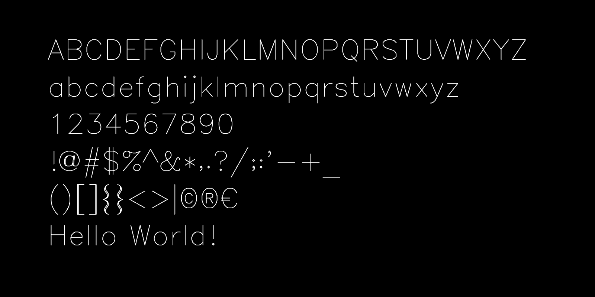
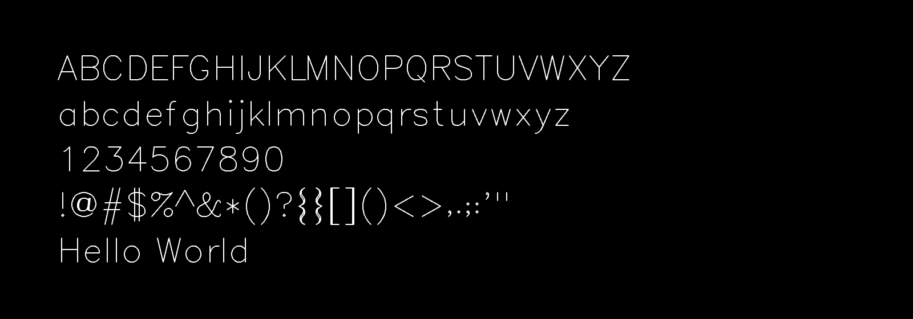

# p5-single-line-font-resources

*This is a repository of p5.js programs for loading and displaying a variety of different single-line vector fonts (also called single-stroke or monoline fonts). Such fonts are well-suited to creative coding and pen-plotting. Code is presented to load single-line fonts in TTF, SVG Font, Hershey Font, and other formats.*

#### Contents

* [p5.js Parser/Renderer for Single-Line TTF Fonts](#p5js-parserrenderer-for-single-line-ttf-fonts)
* [p5.js Parser/Renderer for Single-Line SVG Fonts](#p5js-parserrenderer-for-single-line-svg-fonts)
* [Minimal Hershey SVG Font, Inlined in p5.js](#minimal-hershey-svg-font-inlined-in-p5js)
* [p5.js port of Kamp's HP1345A vector font](#p5js-port-of-kamps-hp1345a-vector-font)
* [p5.js port of Logg/Hudson's *Asteroids* font](#p5js-port-of-logghudsons-asteroids-font)
* [p5.js port of Jared Schiffman's Font](#p5js-port-of-jared-schiffmans-font)
* [Additional Resources](#additional-resources)
* [Some Inspirational Media](#some-inspirational-media)

---

### p5.js Parser/Renderer for Single-Line TTF Fonts

Genuine *single-line* TrueType (.TTF) fonts are comparatively rare, and are not rendered properly by most graphics tools — including p5's built-in `text()` command, as well as commercial tools like Adobe Illustrator. Here, an [archive](p5_single_line_ttf_fonts/single_stroke_ttf_fonts/) of single-line TTF fonts is provided, as well as a p5.js [program](p5_single_line_ttf_fonts/) which is able to load, parse, display, and provide control points for those fonts. Unlike Hershey fonts, many of these TTFs are constructed in part from quadratic Bézier segments, and thus have real curves instead of polylines. 

* [Archive](p5_single_line_ttf_fonts/single_stroke_ttf_fonts/) of single-line TTF fonts, via [imajeenyus.com](http://www.imajeenyus.com/computer/20150110_single_line_fonts/index.shtml)
* Program to load single-line TTFs in p5.js: In [this repository](p5_single_line_ttf_fonts/), & at [editor.p5js.org](https://editor.p5js.org/golan/sketches/7kMYzCpfM)

---

### p5.js Parser/Renderer for Single-Line SVG Fonts

SVG 1.1 Fonts are a lesser-known open standard, defined [here](https://www.w3.org/TR/SVG11/fonts.html), which allows for single-line vector fonts. [Here is a p5.js program](p5_single_line_svg_fonts/sketch.js) that parses and displays SVG Fonts. Developed by Golan Levin in 2024:

* In [this repository](p5_single_line_svg_fonts/)
* At [editor.p5js.org](https://editor.p5js.org/golan/sketches/T-Vf4vvaR)

A large archive of SVG single-line fonts is included [here](p5_single_line_svg_fonts/single_line_svg_fonts/README.md), as a mirror of [a collection](https://gitlab.com/oskay/svg-fonts) curated by Evil Mad Scientist Laboratories. Some additional resources for SVG fonts are:

* [https://gitlab.com/oskay/svg-fonts](https://gitlab.com/oskay/svg-fonts)
* [https://github.com/Shriinivas/inkscapestrokefont](https://github.com/Shriinivas/inkscapestrokefont)
* [https://github.com/isdat-type/Relief-SingleLine](https://github.com/isdat-type/Relief-SingleLine)
* [https://singlelinefonts.com/collections/svg-fonts](https://singlelinefonts.com/collections/svg-fonts)
* [https://www.templatemaker.nl/singlelinetext](https://www.templatemaker.nl/singlelinetext/)

*(Note: of 12/26/2024, this program cannot yet parse SVG fonts with `C` (Bezier curve) path points, such as [Relief](https://github.com/isdat-type/Relief-SingleLine).)*

---

### Minimal Hershey SVG Font, Inlined in p5.js

*This ultra-minimal program presents an Hershey SVG font inlined in p5.js, with no loading of external resources. For a full-featured Hershey Font library for p5.js, see [p5-hershey-js](https://github.com/LingDong-/p5-hershey-js).*

[Hershey Fonts](https://en.wikipedia.org/wiki/Hershey_fonts) are a collection of single-line vector fonts developed in 1967 by Dr. Allen V. Hershey at Dahlgren Naval Weapons Laboratory; they are some of the earliest digital fonts. The various Hershey fonts have been converted to SVG Font format and are available e.g. [here](https://gitlab.com/oskay/svg-fonts/-/tree/master/fonts/Hershey), [here](https://github.com/Shriinivas/inkscapestrokefont/tree/master/strokefontdata), and [here](https://github.com/techninja/hersheytextjs), as discussed above.

The program presented [here](Hershey_inline_font/sketch.js) and at [editor.p5js.org](https://editor.p5js.org/golan/sketches/iqRjuCM-5) displays an *inlined* Hershey SVG font in p5.js. This has been adapted from [hershey font json example](https://editor.p5js.org/allison.parrish/sketches/SJv2DCYpQ) by Allison Parrish.

---

### p5.js port of Kamp's HP1345A vector font

Vector font from the character generator ROM of the HP1345A digital vector display (c.1985), [reverse-engineered](https://phk.freebsd.dk/hacks/Wargames/index.html) by Poul-Henning Kamp, ported to JavaScript by Golan Levin. This p5.js version is adapted from his work, and loads data from the original ROM binaries.

* ROM-loading version [here](HP1345A_single_line_font/sketch.js) or at [editor.p5js.org](https://editor.p5js.org/golan/sketches/ir_bD05uZ)
* Data-inlined version (*recommended*) [here](HP1345A_single_line_font_inline) or at [editor.p5js.org](https://editor.p5js.org/golan/sketches/TzKV33v9g)

---

### p5.js port of Logg/Hudson's *Asteroids* font

Asteroids game vector font by [Atari programmer Ed Logg](https://web.archive.org/web/20141222010537/http://www.edge-online.com/features/making-asteroids/), c.1979, converted to C by [Trammell Hudson](https://trmm.net/Asteroids_font/), ported to p5.js by Golan Levin. Original C data [here](https://github.com/osresearch/vst/blob/master/teensyv/asteroids_font.c).

* In [this repository](Asteroids_single_line_font/sketch.js)
* At [editor.p5js.org](https://editor.p5js.org/golan/sketches/OmiU51Gdm)

---

### p5.js port of Jared Schiffman's Font

Procedural single-stroke monospace font developed by [Jared Schiffman](https://www.jaredschiffman.com/) at the MIT Media Laboratory Aesthetics and Computation Group, c.1999-2000. Ported from C++ to Java and p5.js by Golan Levin.

* In [this repository](JaredSchiffman_single_line_font/sketch.js)
* At [editor.p5js.org](https://editor.p5js.org/golan/sketches/QVljixLNt)
* [Processing (Java) version](JaredSchiffman_monoline_pde/)

---

### Additional Resources

* [Drawing with Machines Typography resources](https://github.com/golanlevin/DrawingWithMachines/blob/main/lectures/topics/type/README.md)
* [Summary of single-line fonts (10/01/15)](http://www.imajeenyus.com/computer/20150110_single_line_fonts/index.shtml), imajeenyus.com
* [Drawingbots.net Text Resources](https://drawingbots.net/resources#12)
* https://www.onelinefonts.com/
* [p5-hershey-js](https://github.com/LingDong-/p5-hershey-js) by Lingdong Huang, a full-featured library (*recommended*). 
* A helpful [Hershey Font Editor](https://hfedit.glitch.me/), also by Lingdong Huang.
* [chinese-hershey-font](https://github.com/LingDong-/chinese-hershey-font), also by Lingdong Huang.

---

### Some Inspirational Media

Research and artworks concerned with single-line fonts.

* [The Hershey Fonts](https://www.youtube.com/watch?v=xQNHAWrR_eg) lecture by Frank Grießhammer
* [Textension: Word Processor Variations (1999)](https://vimeo.com/6121230) by JT Nimoy
* [Viktor](https://juerglehni.com/works/viktor), [Hektor](https://juerglehni.com/works/hektor), [Otto](https://juerglehni.com/works/otto) by Jürg Lehni
* [X-Y-Z](https://opensea.io/collection/x-y-z-by-andreas-gysin) by Andreas Gysin

---

### Keywords

single line font, single stroke font, monoline font, vector font, engraving font, skeleton font, AxiDraw, Hershey font, #plotterTwitter, procedural font, creative coding, p5.js, SVG Fonts, Processing. 

---

### Todo

* Parse SVG Fonts with Curves (ReliefSingleLine-Regular.svg, TwinSans.svg)
* Parse single-line TTF fonts
* Animation + SVG example

