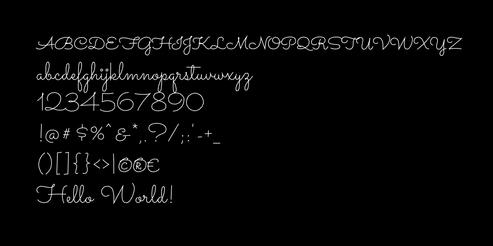

# p5-single-line-font-resources

*This is a repository of p5.js programs for loading and displaying a variety of different procedural single-line vector fonts (also called single-stroke or monoline fonts). Such fonts are well-suited to creative coding and pen-plotting.*

---

### p5.js Parser/Renderer for Single-Line SVG Fonts

SVG 1.1 Fonts are a little-known open standard, defined [here](https://www.w3.org/TR/SVG11/fonts.html), which allows for single-line vector fonts. [This p5.js program](p5_svg_fonts/sketch.js), developed by Golan Levin in 2024, parses and displays SVG Fonts. *(As of 12/26/2024, this program cannot yet parse SVG fonts with `C` (curve) path points.)*

* In [this repository](p5_svg_fonts/sketch.js)
* At [editor.p5js.org](https://editor.p5js.org/golan/sketches/T-Vf4vvaR)

A large archive of SVG single-line fonts is included [here](p5_svg_fonts/single_line_svg_fonts/README.md), as a mirror of [a collection](https://gitlab.com/oskay/svg-fonts) curated by Evil Mad Scientist Laboratories. Some additional resources for SVG fonts are:

* [https://gitlab.com/oskay/svg-fonts](https://gitlab.com/oskay/svg-fonts)
* [https://github.com/Shriinivas/inkscapestrokefont](https://github.com/Shriinivas/inkscapestrokefont)
* [https://github.com/isdat-type/Relief-SingleLine](https://github.com/isdat-type/Relief-SingleLine)
* [https://singlelinefonts.com/collections/svg-fonts](https://singlelinefonts.com/collections/svg-fonts)
* [https://www.templatemaker.nl/singlelinetext](https://www.templatemaker.nl/singlelinetext/)

---

### p5.js port of Kamp's HP1345A vector font

Vector font from the character generator ROM of the HP1345A digital vector display (c.1985), [reverse-engineered](https://phk.freebsd.dk/hacks/Wargames/index.html) by Poul-Henning Kamp, ported to JavaScript by Golan Levin. This p5.js version is adapted from his work, and loads data from the original ROM binaries.

* ROM-loading version [here](HP1345A_single_line_font/sketch.js) or at [editor.p5js.org](https://editor.p5js.org/golan/sketches/ir_bD05uZ)
* Data-inlined version (*recommended*) [here](HP1345A_single_line_font_inline) or at [editor.p5js.org](https://editor.p5js.org/golan/sketches/TzKV33v9g)

---

### p5.js port of Logg/Hudson's *Asteroids* font

Asteroids game vector font by [Atari programmer Ed Logg](https://web.archive.org/web/20141222010537/http://www.edge-online.com/features/making-asteroids/), c.1979, converted to C by [Trammell Hudson](https://trmm.net/Asteroids_font/), ported to p5.js by Golan Levin. Original C data [here](https://github.com/osresearch/vst/blob/master/teensyv/asteroids_font.c).

* In [this repository](Asteroids_single_line_font/sketch.js)
* At [editor.p5js.org](https://editor.p5js.org/golan/sketches/OmiU51Gdm)

---

### Jared Schiffman's Font (1999)

Single-stroke monospace font developed by [Jared Schiffman](https://www.jaredschiffman.com/) at the MIT Media Laboratory Aesthetics and Computation Group, c.1999-2000. 

* In [this repository](JaredSchiffman_single_line_font/sketch.js)
* At [editor.p5js.org](https://editor.p5js.org/golan/sketches/QVljixLNt)
* [Processing (Java) version](JaredSchiffman_monoline_pde/)

---

### Additional Resources

* https://github.com/LingDong-/p5-hershey-js
* Lingdong's [Hershey Font Editor](https://hfedit.glitch.me/)
* [Drawing with Machines Typography resources](https://github.com/golanlevin/DrawingWithMachines/blob/main/lectures/topics/type/README.md)
* [Summary of single-line fonts (10/01/15)](http://www.imajeenyus.com/computer/20150110_single_line_fonts/index.shtml), imajeenyus.com
* [Drawingbots.net Text Resources](https://drawingbots.net/resources#12)
* https://www.onelinefonts.com/

---

### Keywords

single line font, single stroke font, monoline font, vector font, engraving font, skeleton font, AxiDraw, Hershey font, #plotterTwitter, procedural font, creative coding, p5.js, SVG Fonts, Processing. 